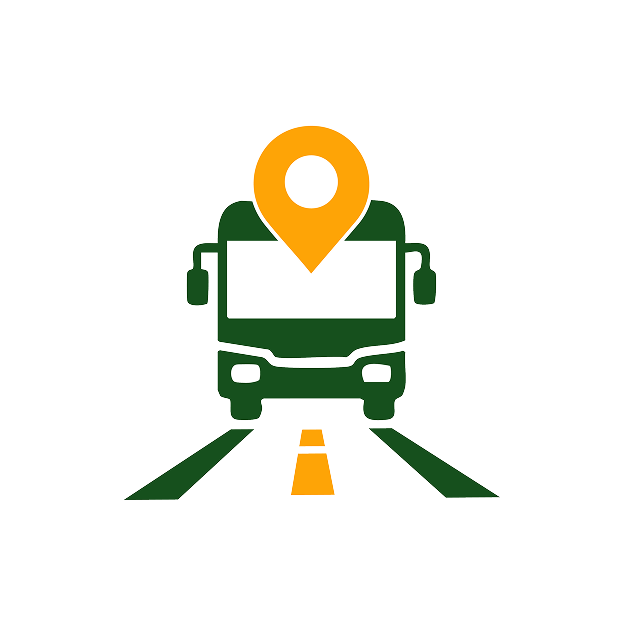
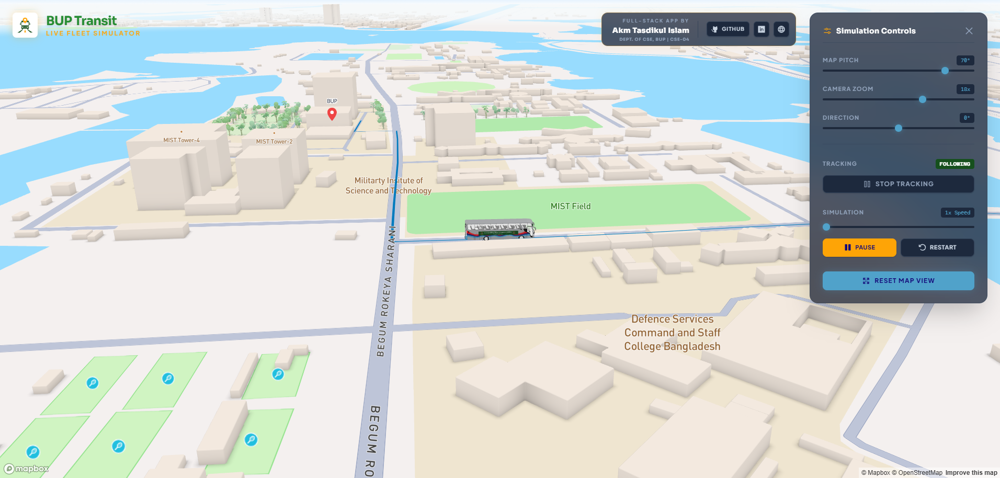

<div align="center">
  

# BUP Transit | Live Fleet Simulator

**An interactive, real-world 3D fleet simulation web application.** <br>
Designed for the Bangladesh University of Professionals (BUP) Transit ecosystem.

[](https://reactjs.org/)
[](https://vitejs.dev/)
[](https://tailwindcss.com/)
[](https://www.mapbox.com/)

[View Live Demo](https://akmtasdikulislam.github.io/bup-transit-3d-bup-simulation/) • [Report Bug](https://github.com/akmtasdikulislam/bup-transit-3d-bup-simulation/issues)

</div>

---

## ✨ Overview

The **BUP Transit Live Fleet Simulator** is a dynamic, map-based 3D web application that tracks the university's customized transit fleet across a real-world environment. Powered by Mapbox GL JS and Threebox, the simulator features realistic 3D building extrusions, a fully animated 3D bus following GeoJSON route data, and depth-aware WebGL markers. All of this is controlled through a premium, responsive glassmorphism UI.

<div align="center">
  
</div>

---

## 🚀 Key Features

- **Live 3D Animation:** The BUP bus automatically drives along a precise geographical route using Turf.js spatial calculations.
- **Dynamic Camera Tracking:** Toggle "Follow Bus" mode to automatically lock the map camera to the moving 3D model, or free-roam the map.
- **Simulation Controls:** Play, pause, restart, and adjust the live speed multiplier of the simulation directly from the UI.
- **Advanced Map Controls:** Smooth sliders to control Map Pitch (0°-85°), Camera Zoom (10x-22x), and Map Direction/Bearing.
- **Depth-Aware WebGL Markers:** Custom SVG Mapbox pins rendered natively in the WebGL context, allowing the 3D bus to physically occlude (hide) markers as it drives past them.
- **Responsive Glassmorphism UI:** A collapsible, frosted-glass control drawer that seamlessly hovers over the 3D map[cite: 20, 22].
- **Asset Protection:** Implements basic DOM-level security hooks (disabling right-click and common inspector shortcuts) to deter unauthorized inspection[cite: 20, 22].

---

## 🛠️ Tech Stack

| Category               | Technologies                         |
| ---------------------- | ------------------------------------ |
| **Frontend Framework** | React 19, Vite                       |
| **Styling & UI**       | Tailwind CSS v4, Phosphor Icons      |
| **Mapping Engine**     | Mapbox GL JS                         |
| **3D Integration**     | Three.js, Threebox-plugin            |
| **Geospatial Math**    | Turf.js                              |
| **Typography**         | Sora, Plus Jakarta Sans, Azeret Mono |
| **Deployment**         | GitHub Pages                         |

---

## 💻 Local Development

To run this project locally, follow these steps:

**1. Clone the repository:**

```bash
git clone [https://github.com/akmtasdikulislam/bup-transit-3d-bup-simulation.git](https://github.com/akmtasdikulislam/bup-transit-3d-bup-simulation.git)
cd bup-transit-3d-bup-simulation

```

**2. Install dependencies:**

```bash
npm install

```

**3. Set up Environment Variables:**
Create a `.env` file in the root directory and add your Mapbox Access Token:

```env
VITE_MAPBOX_ACCESS_TOKEN=pk.your_mapbox_token_here

```

**4. Start the development server:**

```bash
npm run dev

```

**5. Build for production:**

```bash
npm run build

```

---

## 🎨 Attribution & Credits

### Full-Stack Engineering & UI/UX

The custom BUP livery design, glassmorphism UI/UX architecture, and React map integration were engineered by:

- **Akm Tasdikul Islam**

- DEPT. of CSE, BUP | Batch: CSE-04

- [GitHub](https://www.google.com/search?q=https://github.com/akmtasdikulislam) • [LinkedIn](https://www.google.com/search?q=https://www.linkedin.com/in/akmtasdikulislam) • [Website](https://www.akmtasdikulislam.dev)

### Base 3D Geometry

The underlying 3D bus mesh is generously provided under a creative commons license. The base geometry was not created by the author of this repository and full credit for the original mesh goes to the original artist:

- **Base Model:** [Indonesian bus Ecoline](https://sketchfab.com/3d-models/indonesian-bus-ecoline-fda12812ab1147b79c1a6c7aa3adc5f8)

- **Author:** [agungkuncoro13021986](https://www.google.com/search?q=https://sketchfab.com/agungkuncoro13021986) on Sketchfab.

---

```

```
